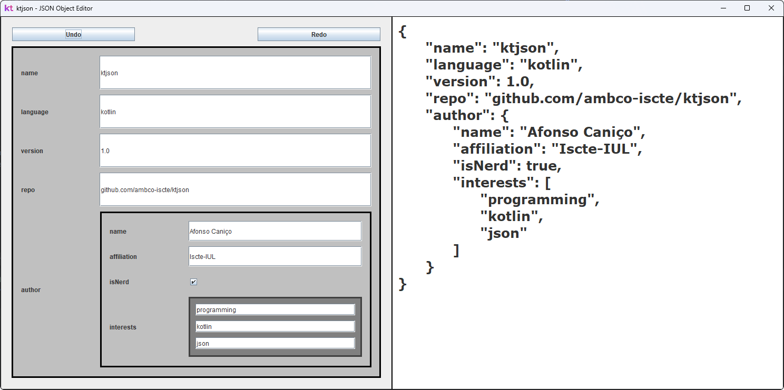

<br>

<picture>
  <source media="(prefers-color-scheme: dark)" srcset="resources/header-light.png">
  <source media="(prefers-color-scheme: light)" srcset="resources/header-dark.png">
  
</picture>

# What is this?
**kt**json is a dynamic JSON generation and manipulation library for Kotlin. In short, it allows for the dynamic 
generation of JSON representations of Kotlin data class instances, or the instantiation of data classes
from JSON representations. 

This library was developed as the final project for an [Advanced Programming](https://fenix.iscte-iul.pt/disciplinas/m4310/2022-2023/2-semestre) course as part of the 
[Master's (MSc) in Computer Engineering](https://www.iscte-iul.pt/course/12/master-msc-in-computer-engineering) programme at [Iscte-IUL](https://www.iscte-iul.pt/).
<br>

# Features
## Phase 1 - Abstract Model, Reflection
- [x] Abstract JSON model using Kotlin data classes
- [x] Basic JSON model visitor functionality (Visitor pattern)
- [x] Serialization of Kotlin objects to abstract JSON models
- [x] **(Extra)** Parsing of JSON-formatted text files to abstract JSON models
- [x] **(Extra)** Deserialization of abstract JSON models to Kotlin object instances

## Phase 2 - Model, View, Controller
- [x] Listeners for JSON element types implemented in Phase 1
- [x] Commands to support JSON element actions implemented in Phase 1
- [x] Graphical User Interface implementing the MVC pattern to edit JSON objects
  - [x] Displaying JSON elements
  - [x] Updating the value of properties in a JSON object
  - [x] Adding and removing properties from JSON objects
  - [x] Adding and removing elements in a JSON array

<br>

# Examples
The following examples showcase the basic functionality of **kt**json's serialization and deserialization
capabilities. Check out [the documentation](https://ambco-iscte.github.io/ktjson/) for a more in-depth look!

## Serialization
More in-depth serialization examples can be found [here](src/test/kotlin/TestSerialization.kt).
```kotlin
import dynamic.*
import model.*

fun serializationExample() {
    // Some data classes we want to serialize
    data class Student(val name: String, @Stringify val number: Int, @DoNotSerialize val internalID: Int)
    data class Professor(val name: String, val areasOfResearch: List<String>)
    data class CurricularUnit(
        @DoNotSerialize val internalID: String,
        @SerializeAs("name") val identifier: String,
        val coordinator: Professor,
        @SerializeAs("professors") val faculty: Set<Professor>,
        @SerializeAs("students") val studentBody: Set<Student>,
        val program: List<String>
    )

    // A particular instance of one of our data classes
    // Note the inclusion of collection and nested object properties
    val advancedProgramming = CurricularUnit(
        "M4310",
        "PA",
        Professor("André Santos", listOf("Pedagogy", "Programming", "Kotlin")),
        setOf(Professor("Probably ChatGPT", listOf("Everything"))),
        setOf(Student("Afonso", 92494, 0)),
        listOf("Kotlin", "Reflection", "Visitors")
    )

    // Pretty-print (built-in!) of the serialized JSON model
    // Try it out yourself!
    println(advancedProgramming.serialize())
}
```

## Deserialization
More in-depth deserialization examples can be found [here](src/test/kotlin/TestDeserialization.kt).
```kotlin
import dynamic.deserialize
import dynamic.serialize

fun deserializationExample() {
    // Note the absence of annotations - if we want to deserialize later, we can't change or
    // lose any information during the serialization process
    data class Student(val name: String, val number: Int, val studentType: StudentType, val internalID: Int)
    data class Professor(val name: String, val areasOfResearch: List<String>)
    data class CurricularUnit(
        val internalID: String,
        val identifier: String,
        val coordinator: Professor,
        val faculty: Set<Professor>,
        val studentBody: Set<Student>,
        val program: List<String>
    )

    // A particular instance of one of our data classes (same as in the example above)
    val advancedProgramming = CurricularUnit(
        "M4310",
        "PA",
        Professor("André Santos", listOf("Pedagogy", "Programming", "Strudel", "Weird Kotlin Things")),
        setOf(Professor("Probably ChatGPT", listOf("Everything"))),
        setOf(Student("Afonso", 92494, StudentType.INTERNATIONAL, 0)),
        listOf("Kotlin", "Reflection", "Visitors")
    )

    // Check that calling deserialize(thing.serialize()) just returns the same thing
    // We expect this to print "true" to the console. Try it out yourself!
    println(uc == CurricularUnit::class.deserialize(advancedProgramming.serialize()))
}
```

## Parsing
More in-depth parsing examples can be found [here](src/test/kotlin/TestParsing.kt).
```kotlin
import model.*

// This is it (it's super easy)
fun parsingExample() {
    val json: JSONObject = JSONElement.parse("myJsonFile.json") // Parse a whole file
    val bool: JSONBoolean = JSONElement.parseLiteral("true") // Parse a literal
}
```

## Manipulation
More in-depth manipulation examples can be found [here](src/test/kotlin/TestModel.kt).
```kotlin
import model.*

fun manipulationExample() {
    // Create an empty JSON object
    val obj = JSONObject.empty()
  
    // Add some properties
    obj.addProperty("name", JSONString("ktjson"))
    obj.addProperty("language", JSONString("kotlin"))
    obj.addProperty("author", JSONString("ambco"))
  
    // Replace a property
    obj.setProperty("author", JSONString("Afonso Caniço"))
  
    // Remove a property
    obj.removeProperty("author")
  
    // Does the object have a property with key "name"?
    println(obj.hasProperty("name"))
}
```

## Visitors
More in-depth visitor examples can be found [here](src/test/kotlin/TestModel.kt).
```kotlin
import model.*
import model.elements.*

// Example visitor: collect all JSON properties that have the same key
class CollectByKey(private val key: String) : JSONVisitor {
    val collected: MutableList<JSONElement> = mutableListOf()
  
    // Override visit() methods for the types of elements you want to run
    // custom code on
    override fun visit(property: JSONProperty) {
      if (property.key == key)
        collected.add(property.value)
    }
  
    // Composite elements (arrays and objects) return True or False depending on
    // whether their "children" (elements or properties) should be visited
    override fun visit(array: JSONArray): Boolean = true
    override fun visit(obj: JSONObject): Boolean = true
}

// Example: load a JSON file and collect all object properties that have key "id"
fun visitorsExample() {
    val collector = CollectByKey("id")
    JSONElement.parse("").accept(collector) // Run the visitor through the object
    println(collector.collected) // Print the list of collected keys
}
```

## Observers / Listeners
More in-depth manipulation examples can be found [here](src/test/kotlin/TestListeners.kt).
```kotlin
import model.elements.*
import model.listeners.JSONArrayListener
import model.listeners.JSONObjectListener

// Example: count the number of properties added to, removed from, and updated on an object
fun objectListenerExample() {
    val obj = JSONObject.empty()
  
    var added = 0
    var removed = 0
    var updated = 0
  
    // Attach a listener to the object
    obj.addListener(object : JSONObjectListener {
        // Override the functions of the actions you want to listen to
        override fun onPropertyAdded(property: JSONProperty) { added++ }
        override fun onPropertyRemoved(property: JSONProperty) { removed++ }
        override fun onPropertyUpdated(old: JSONProperty, new: JSONProperty) { updated++ }
    })
  
    // Add, remove, and update some properties (see above) ...
  
    println("Added: $added")
    println("Removed: $removed")
    println("Updated: $updated")
}

// Example: count the number of elements added to, removed from, and set on an array
fun arrayListenerExample() {
    val array = JSONArray(mutableListOf())
  
    var added = 0
    var removed = 0
    var set = 0
  
    // Attach a listener to the array
    array.addListener(object : JSONArrayListener {
        // Override the functions of the actions you want to listen to
        override fun onElementAdded(element: JSONElement) { added++ }
        override fun onElementRemoved(index: Int, element: JSONElement) { removed++ }
        override fun onElementSet(index: Int, element: JSONElement) { set++ }
    })
  
    println("Added: $added")
    println("Removed: $removed")
    println("Set: $set")
}
```

<br>

# Using the Editor
**kt**json includes a built-in GUI that allows for dynamically editing JSON objects. By using the built-in GUI, you can:
- Add, change, and remove object properties;
- Add, change, and remove array elements;
- See your changes in real-time in the GUI, both in the object structure and in typical JSON text syntax.



The editor includes functionality to allow for listening for changes in the GUI elements and to execute all the JSON
manipulation actions as undo-able commands. 

A full example on how to make use of the editor's functionalities can be found in
[EditorExample.kt](src/main/kotlin/mvc/EditorExample.kt).

<br>

# Credit

Full credit for the basic specification of the library's requirements goes to Professor 
[André L. Santos](https://andre-santos-pt.github.io/), Assistant Professor at Iscte-IUL and coordinator of the course
this library was developed for. The original specifications for each phase of the course's final project can be found here:
- [Phase 1 - Abstract Model, Reflection](https://andre-santos-pt.github.io/projetojson/primeirafase)
- [Phase 2 - Model, View, Controller](https://andre-santos-pt.github.io/projetojson/segundaparte)

Credit for all the code present in this repository goes to 
[Afonso Caniço](https://ciencia.iscte-iul.pt/authors/afonso-canico/cv), author and sole contributor to the project
and this repository, unless otherwise explicitly stated. Code heavily inspired by or taken from the Advanced Programming
[course materials](https://andre-santos-pt.github.io/kotlin/) is properly and explicitly identified.